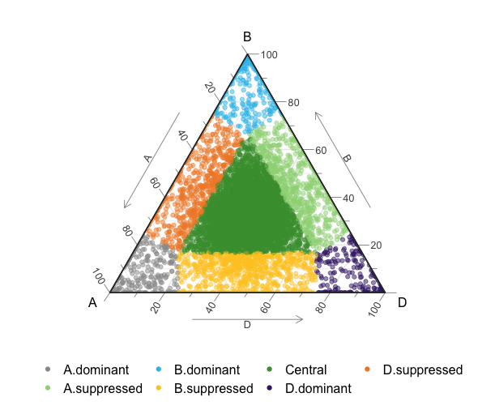
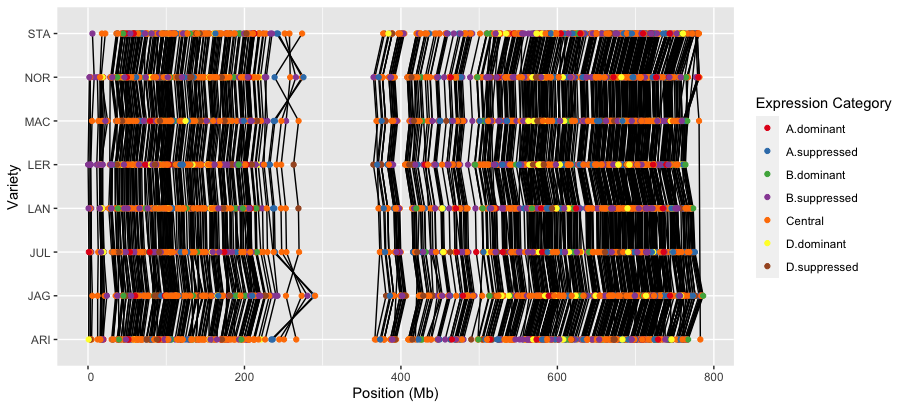

# Summary

The `triad.expression` R package seeks to provide methods for analyzing and visualizing
patterns of gene expression in sets of homologous genes in the Wheat genome called Triads.
A Triad is a set of three homologous (related in position and function) genes where a
gene exists in the A, B, and D sub genomes of Wheat.
Each of the three genes in a triad may be expressed at different levels in different
tissues or in different Wheat varieties.
`triad.expression` allows you to compute mean gene expression levels of triads across
combinations of factors such as experimental condition, or tissue, allowing the
detection of changes in gene expression between levels of those factors.
Using the mean expression values computed for triads `triad.expression` can categorize
triads into one of seven expression categories, visualize expression levels of triads
as ternary plots, and visualize triad expression categories across chromosomes and
between factor levels such as variety.


# Statement of need

The wheat genome has a complex structure consisting of three subgenomes, named
A, B, and D, and it is highly repetitive.
As a result of this structure, for any gene you might pick from any subgenome,
there are often homologous genes (i.e. related in position structure and
function, typically as a result of evolutionary relatedness) in the other two
sub genomes. Each set of three related genes is called a Triad. Each gene in a
Triad may have different expression levels and each Triad may be categorized
into one of seven different expression categories, and these categories may
change between types of tissue, between different cultivars of wheat, and other
factors.

Computing the expression categories of Triads, and looking for patterns and
changes in expression categories between Wheat variety, tissue, or other
factors requires the integration of many different kinds of data, including,
but not necessarily limited to:

- Expression data from RNA sequencing experiments.
- Metadata describing those experiments.
- Data describing the Triad homologies (i.e. which genes belong to which triad).
- Annotation data describing the genomic locations of genes, in different Wheat
  varieties.

The `triad.expression` has been created to help make the process of computing
Triad expression categories and analyzing patterns and differences in those
categories for various factors much easier. It does so by both providing the
functions that compute these analyses from data, but also by providing some
pre-prepared sets of the data just listed above. Any or all of which may be
swapped out with new data if the user has some generated.

`triad.expression` has already been used in a number of scientific
publications [], and the feature set and data provided continues to be updated
as more Wheat Bioinformatics projects use it for more use-cases. This package
will continue to make it trivial to explore the effects of many different
biological factors on Triad expression patterns, helping anyone working
to better understand the genomic underpinnings of Wheat's biology.

# Features of `triad.expression`

All these features are documented in more detail in the package vignette.

## Included data

The package has some data files included that have been used in past projects.
All of them or (more likely) some of them can be swapped out for your own novel data-sets.

### Triad homology
Triads are made up of three homologous genes from the A, B, and D sub-genomes of wheat.  
This package makes use of, and includes, a data set that describes these homologies.
To load it for use, simply use `data(triad_homology)`.

### Gene locations
Genomic locations (chromosome, start position, end position, strand etc.) of the genes in each triad.
This data is included in this package for several varieties of wheat.
This data is loaded for use through the `data(gene_locations)` command.

### Gene expression data
Analyses in the package make use of gene expression data for the triads.
This data includes both the raw expression values obtained from experiment,
as well as a table of metadata about the samples and the experiments they came from.

The metadata is accessed using `data(expression_metadata)`, and expression level data is
accessed using `data(expression_data)`.

## Analyses

## Computing mean gene expression values and classifying triads
`triad.expression` can compute the mean expression values for each triad gene, for
every level of combination of factors, through the use of a function called `triad_expression_means_by_factors`.
This function takes the expression data sets, and the triad homology information, and
a list of metadata column names to use as the factors.
For example, in the `expression_metadata` included with the package, there is a column
called "High.level.variety", with a level for each variety of wheat. This can be used
as a factor.

```R
library(triad.expression)

data(expression_data)
data(expression_metadata)
data(triad_homology)

meanExpressionByVarietyAndTissue <-
    triad_expression_means_by_factors(expression_data,
                                      expression_metadata,
                                      triad_homology,
                                      c("High.level.variety",
                                        "High.level.tissue"))
```

Once these values have been computed, you can normalize the data, which is done with the
`normalize_triad_expression_means` function.

```R
normalizedMeans <- 
    normalize_triad_expression_means(meanExpressionByVarietyAndTissue)
```

Once you have normalized mean triad expression data, using the `centroid_distances` function,
you can compute each triads distance from the centroids, and from the centroids, assign to each
triad one of 7 expression categories:

- Central
- A dominant
- B dominant
- C dominant
- A suppressed
- B suppressed
- D suppressed

```R
cDistances <- centroid_distances(normalizedMeans)
```

## Plotting

### Ternary plots

Once you have computed centroid distances `triad.expression` helps you produce ternary plots
through the `make_expression_ternplot` function.
Some filtering of the computed centroid distances data may be necessary, as in the example below.

```R
library(dplyr)
cDistances %>%
  # We only want to plot the data for aerial organ
  # tissue and the ARI variety.
  filter(High.level.tissue == "aerial organs",
         High.level.variety == "ARI") %>%
  make_expression_ternplot
```

The resulting ternary plots look like the example in \autoref{fig:exampletern}:




### Loom plots

Structural rearrangements of the genome that have occurred during Wheat's evolutionary history,
may be linked to changes in a Triad's expression pattern. In addition so could other spatial factors
such as where a triad exists in the genome.

To help visualize such phenomena `triad.expression` provides a function called `loom_plot`.
Depending on how you preprocess the data you can visualize a few different phenomena with it.

The first step is typically to merge your computed triad distances with the gene_locations data provided in
`triad.expression`, or your own:

```R
data(gene_locations)
distWithLocation <- join_distances_and_annotation(cDistances, gene_locations)
```

From here, this data can be pre-processed and passed to the `loom_plot` function.
In this case, the data is limited to only one chromosome, 2A, and to the root tissue.
Then it is filtered to exclude triads that don't ever differ in expression pattern between
the different Wheat varieties.

The `loom_plot` function accepts a variable to use as the x-axis, y-axis, for drawing the connecting lines, and for color.
In the example blow the x-axis is the start position of every triad gene, High.level.variety is the y-axis, group_id (triad)
is used to draw the connecting lines, and clust.description (expression pattern) is used for color.

```R
distWithLocation %>%
  # Limit to Chromosome 2A, and the root tissue.
  filter(chr == "chr2A", High.level.tissue == "root")  %>%
  # Exclude triads that never differ in expression between
  # the different wheat varieties.
  group_by(group_id) %>%
  filter(n_distinct(clust.description) > 1) %>%
  # Plot!
  loom_plot("start",
            "High.level.variety",
            "group_id",
            "clust.description",
            yLab = "Variety")
```

The resulting loom plot looks like the example in \autoref{fig:exampleloom}:




# Acknowledgements

We acknowledge the work of Dr Ricardo H Ramírez González from the John Innes Centre, who's supplementary scripts xxx formed the initial inspiration for this package.

# References
